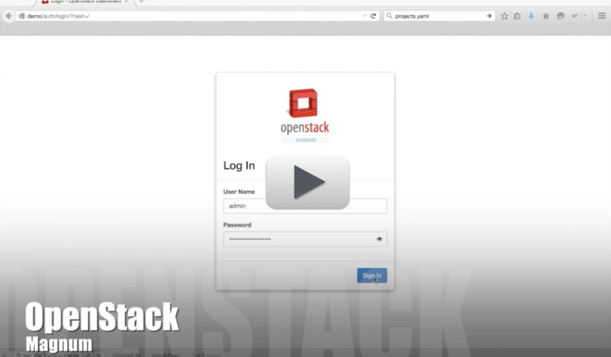
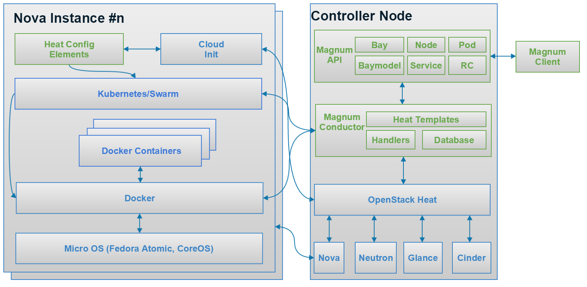

# Magnum

Magnum 由 OpenStack Container Team 開發的 ```container orchestration engines```，像是 Docker 和 Kubernetes 可作為 OpenStack 上第一類資源開發的 OpenStack API 服務。Magnum 使用 Heat 來編配(orchestrate) OS 映像檔(image)，其中包含 Docker 和 Kubernetes，並依照叢集配置執行在任何的虛擬機或裸機(bare metal)中。以下為5分鐘的 Magnum Demo 影片。
[](https://vimeo.com/128538940)

## 最新消息
* 2015-10-20 We have published a list of [sessions to attend](https://wiki.openstack.org/wiki/Magnum/Summit) at the Mitaka Design Summit in Tokyo
* 2015-08-26 Magnum will be presenting [a session on Magnum](http://sched.co/49xE) at the 2015 OpenStack Summit in Tokyo on October 28 4:40pm - 5:20pm [Video](https://www.openstack.org/summit/tokyo-2015/videos/presentation/openstack-magnum-containers-as-a-service)
* 2015-05-21 We presented [a session on Magnum](https://openstacksummitmay2015vancouver.sched.org/event/ec3936678ef22681408088ec52a4e80b) at the 2015 OpenStack Summit in Vancouver on Thursday, May 21 9:00am - 9:40am US/Pacific. [Video](https://www.openstack.org/summit/vancouver-2015/summit-videos/presentation/magnum-containers-as-a-service-for-openstack)
* 2015-03-24 Magnum has [officially joined](https://review.openstack.org/161080) the OpenStack project list upon approval by a unanimous vote by the Technical Committee.
* 2015-03-09 Our Kilo-2 release is now available for download.
* 2015-01-20 We have announced Magnum's first release, now available for download.

## 如何開始與下載
開始使用 Magnum 請參考：[快速開始指南](http://docs.openstack.org/developer/magnum/dev/dev-quickstart.html)

版本 1.0.0.0b1 (Liberty Beta 1)下載：
* [magnum](http://tarballs.openstack.org/magnum/magnum-1.0.0.0b1.tar.gz)
* [python-magnumclient](http://tarballs.openstack.org/python-magnumclient/python-magnumclient-1.0.0.0b1.tar.gz)

## 貢獻
該專案由我們 OpenStack Containers Team 積極開發。我們每週使用 [IRC](https://wiki.openstack.org/wiki/Meetings/Containers) 進行會議討論，而會議通常由 PTL [Adrian Otto](https://launchpad.net/~aotto) 主持。
* 我們需要您[貢獻 Magnum](https://wiki.openstack.org/wiki/Magnum/Contributing) !

## 架構

Bay Create/Update/Delete

## 參考資料
* Launchpad Project Pages
	* [Magnum Launchpad Project](http://launchpad.net/magnum) for Blueprints
	* [python-magnumclient Launchpad Project](http://launchpad.net/python-magnumclient) for Blueprints
* Mailing List
	* [OpenStack Mailing List](http://lists.openstack.org/cgi-bin/mailman/listinfo/openstack-dev) for project related discussion
		* Add [Magnum] to the subject line of new posts about this project.
	* [OpenStack Mailing List Archives](http://lists.openstack.org/pipermail/openstack-dev/) for current discussion.
* Code Reviews
	* [Gerrit Reviews](https://review.openstack.org/#/q/status:open+magnum,n,z)
* Code Repository
	* git clone git://git.openstack.org/openstack/magnum
* Specification
	* [Containers Service Spec](https://review.openstack.org/136103)
	* [Container Networking Model Spec](https://review.openstack.org/204686/)
* References
	* [Magnum Networking Details](https://wiki.openstack.org/wiki/Magnum/Networking)
	* [Network Driver Support Matrix](https://wiki.openstack.org/wiki/Magnum/NetworkDriverMatrix)
	* [Labels Support Matrix](https://wiki.openstack.org/wiki/Magnum/LabelMatrix)
	* [Acronyms](https://wiki.openstack.org/wiki/Magnum/Acronyms)
	* [IRC Logs - OpenStack Containers](http://eavesdrop.openstack.org/irclogs/%23openstack-containers/)
	* [Meeting Minutes - OpenStack Containers](http://eavesdrop.openstack.org/meetings/containers/2015/)

## IRC
我們的開發者都在 freenode 上的 ```#openstack-containers``` 進行開發討論。

## 會議
* 於每四下午4點UTC 進行 Containers [IRC 會議](https://wiki.openstack.org/wiki/Meetings/Containers)[\[schedule\]](https://wiki.openstack.org/wiki/Meetings/Containers)。
* [2014 Containers 會議存檔](http://eavesdrop.openstack.org/meetings/containers/2014/)

## 常見問題
#### 1) Magnum 與 Nova 之間的差異？
Magnum 提供一個專用的 API 來管理應用程式的容器(containers)，而其中與 Nova(machine) instance 最大的差異是生命週期與操作。實際上我們使用 Nova instances 來執行我們應用程式的容器(containers)。

#### 2) Magnum 與 Docker 和 Kubernetes 之間的不同？
Magnum 提供一個非同步的 API 且與 Keystone 兼容以及完整的多租戶(multi-tenancy)實現。它並不會對內部執行編配(orchestration)，而需依賴於 OpenStack Orchestration。Magnum 同時利用 Kubernetes 與 Docker 作為其中元件。

#### 3) 這與 Nova-Docker 相同嗎？
並不相同，對於 Nova 來說 Nova-Docker 是一個 virt driver，允許容器(containers)建立如同 Nova instances，若您想將你的容器(containers)視為輕量級虛擬機，這種情況下 Nova-Docker 是非常適合的。Magnum 提供了一些超出 Nova API 能處理範圍的容器特定功能並實現了自己的 API，而表面上這些特徵在某種程度上是與其他 OpenStack 服務一致。使用 Magnum 啟動的容器(containers)是透過 Heat 執行在 Nova instance 之上。

#### 4) 什麼是 Magnum？
Magnum 為 OpenStack 雲端營運商(公有或私有)提供容器(containers)主機代管服務給雲端使用者的解決方案。Magnum 簡化與 OpenStack 整合需求，並允許雲端使用者可以啟動雲端資源，像是 Nova instances、Cinder Volumes、Trove Databases 等，也可以建立應用程式在容器(containers)之中，提供超越現有雲端資源的高級功能的範圍。用於建立 IaaS 資源的身份驗證也可用於 Magnum 來建立容器化(containerized)的應用程式。以下為高級功能可用於 Magnum 的範例，擴展應用程式至特定虛擬機數量，而當錯誤事件發生可以重新產生您的應用程式，且比虛擬機更緊密的封裝您的應用程式。

#### 5) 若我使用 Heat 中的 Docker resource 是否會得到相同的事情？
並不相同，Docker Heat resource 並不提供資源調度或者容器技術使用的選擇，它是專門針對 Docker 且使用 Glance 來儲存容器映像檔(container images)，它目前不允許分層的映像檔的特點，相較於分層的映像檔基於本地快取的映像檔，這可能導致需要較長的時間啟動容器(containers)。Magnum 充分利用 Docker 速度上的好處。

#### 6) 在 Magnum 中，何謂 multi-tenancy(是 Magnum 安全性)?
透過 Magnum 建立的資源，像是容器(containers)、Services、Pods、Buys 等，僅能被建立它們的租戶的使用者查看與存取。Bays 是不可以分享的，這代表 neighboring tenates 它們的容器(containers)是運行在不同的核心(kernel)。這是一個關鍵的安全性功能，允許容器(containers)屬於同一租戶是緊密包在相同的 Pods 或 Buys，但運行再不同的核心(在不同的 Nova instances)於不同租戶之間。這不同於使用沒有 Magenum 的 Kubernetes 系統，其目的僅有一個單一租戶的使用，並且設計並實現離開安全性隔離。Magnum 提供了與 Nova 一樣的安全性隔離；當運行虛擬機屬於不同租戶在相同計算節點上。
